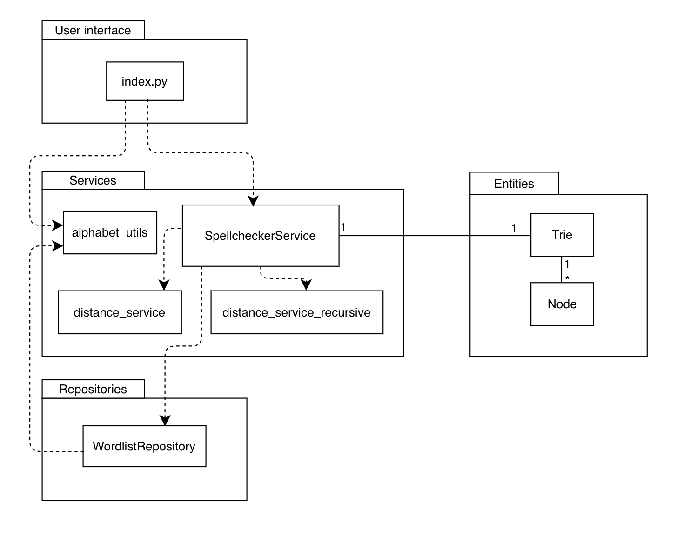

# Implementation Document

(Work in progress)

## Architecture

The code of the application is split into three layers: the user interface, the service layer and the repository layer.
- The _user interface_ is handled by [index.py](../src/index.py).
- The _services package_ contains the service layer code, i.e. the app logic and the algorithms for calculating Damerau-Levenshtein distances. The application logic is handled by the [SpellcheckerService-class](../src/services/spellchecker_service.py). The module [distance_service.py](../src/services/distance_service.py) contains the basic algorithm for calculating the Damerau-Levenshtein distance between two words. The module [distance_service_recursive.py](../src/services/distance_service_recursive.py) contains a recursive implementation of the Damerau-Levenshtein algorithm where the calculations of edit distances are done while traversing the trie data structure containing the reference word list. The classes related to the Trie data structure ([Trie](../src/entities/trie.py) and [Node](../src/entities/node.py)) are contained in the _entities package_.  
- The _repositories package_ contains the class [WordlistRepository](../src/repositories/wordlist_repository.py), which handles the reading from and writing to the file on disk containing the wordlist used as a reference dictionary when checking the spelling of a given word. The filename of the wordlist used can be set in the [.env-file](../.env) in the project root.

## Algorithms and data structures utilized

(Work in progress)

### Trie

The reference wordlist/dictionary used for checking the spelling of and finding correctly spelled suggestions for a given word is loaded from a file on disk into a [trie](https://en.wikipedia.org/wiki/Trie) when the program starts. 

The time complexity for insertion, lookup and deletion in a trie is O(m), where m is the length of the key (in this case, a string representing a word). The time complexity of building the trie is thus O(n * m), where n is the number of words in the dictionary.

Every node in the trie contains a Python list of pointers to possible child nodes. The list has a constant size for every node in the trie, with the number of elements in the list corresponding to the number of characters in the alphabet used. This makes the lookup for child nodes fast, but increases the space complexity of the trie, since memory is allocated for a list of the size of the alphabet for every node, even if most nodes will never use some of the pointers.

### Damerau-Levenshtein algorithm

- Basic implementation: comparing two words. Requires calculating the contents of a matrix with the dimensions len(source word) x len(target word), i.e. O(n x m)-time complexity.
- Comparing misspelled word to all words in large dictionary. App contains two implementations:
    - _for-loop_: matrix is calculated for each word in the dictionary separately.  
    Upper bound for time complexity: O(number of words x (maximum word length)^2)
    - _recursive approach_: Only one matrix row is calculated per node in the trie.  
    Upper bound for time complexity: O(maximum word length * number of nodes in the trie)
- The effect of introducing a _maximum allowed edit distance_: words in the dictionary for which the
length difference to the misspelled word exceeds the maximum allowed edit distance can be skipped without a calculation, which increases the speed of the search.
- The program also allows for an optional prioritisation of misspellings where a character has been replaced with a character on a neighbouring key on the keyboard (one of several possible typographical errors that might occur when typing on a keyboard.) This is achieved by assigning substitutions by a neighbouring key a lower edit cost than other substitutions when calculating Damerau-Levenshtein distances.

## Wordlists used

- List of English words: https://github.com/first20hours/google-10000-english ([License](https://github.com/first20hours/google-10000-english/blob/master/LICENSE.md))
- [Wikipedia: List of common misspellings](https://en.wikipedia.org/wiki/Wikipedia:Lists_of_common_misspellings/For_machines) ([CC BY-SA 3.0](https://creativecommons.org/licenses/by-sa/3.0/))

## Sources

- https://en.wikipedia.org/wiki/Damerau%E2%80%93Levenshtein_distance
- https://web.archive.org/web/20180814145642/https://scarcitycomputing.blogspot.com/2013/04/damerau-levenshtein-edit-distance.html, copy on https://www.lemoda.net/text-fuzzy/damerau-levenshtein/index.html
- http://stevehanov.ca/blog/index.php?id=114
- https://en.wikipedia.org/wiki/Wagner%E2%80%93Fischer_algorithm
- https://en.wikipedia.org/wiki/Trie
- https://medium.com/smucs/trie-data-structure-fd2de3304e6e
