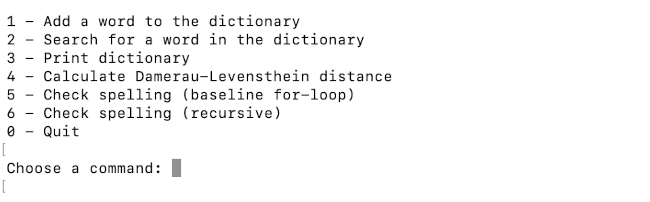

# Instructions for Use

Download and unzip the source code of the latest release from the [Releases page](https://github.com/piamanns/spellchecker/releases).

## Configurations

The program contains a reference dictionary of correctly spelled English words, as well as a list of common misspellings with corresponding intended spellings, which can be used for performance testing.
The file name of both lists is configurable through the [.env-file](../.env) in the project root. Both lists must pe placed in the data directory in the project root.   

**Note:** The wordlist containing correctly spelled words must have one word per row, each row ending in a line break. The format of the file containing the list of misspellings must follow the syntax of the default list, that is, one pair of misspelling->intended spelling (for example succeds->succeeds) per row, followed by a line break.

## Starting the program

Install the project dependencies from the command line by typing:

```bash
poetry install
```

After the dependencies have been installed, the program can be started by typing:

```bash
poetry run invoke start
```

## Using the program

The program is used through a text-based command line-interface:



**1 - Add a word to the dictionary**

Adds a new word to the reference dictionary used in the app.

**2 - Search for a word in the dictionary**

Searches for a given word in the dictionary.

**3 - Print dictionary**

Prints out the dictionary stored in the trie.

**4 - Calculate Damerau-Levensthein distance**

Calculates the true Damerau-Levenshtein distance between two given words.  
The user can choose to assign a lower edit cost for substitutions by a neighbouring key on the keyboard by typing "y" when asked.  

The command also prints out the matrix resulting from the calculation, where the _source_ word (the word entered first) is represented by the rows, and the _target_ word (the word entered second) is represented by the columns:


**5 - Check spelling (baseline for-loop)**

The command checks the spelling of the entered word using the baseline implementation of the spellchecker algorithm.  
The maximum Damerau-Levenshtein distance allowed between the misspelled word and suggested spellings can be entered as an integer.  

The optional prioritisation of neighbouring key substitutions is chosen by entering "y".  

In addition to suggested correct spellings, the command also prints out some statistics on the time used for searching and the size of the dictionary:


**6 - Check spelling (recursive)**

The command checks the spelling of the entered word using the recursive implementation of the spellchecker algorithm. As with the command for the baseline implementation, the maximum edit distance can be entered, an optional priorisation of substitutions by neighbouring keys is available, and statistics on the search are printed out in addition to the results:


**0 - Quit**

Quits the program.


## Running performance tests

Performance tests can be run on batches of spelling errors through the use of the Performance Tester class and script, as described in the [testing document](../documentation/testing_document.md#performance-testing).
