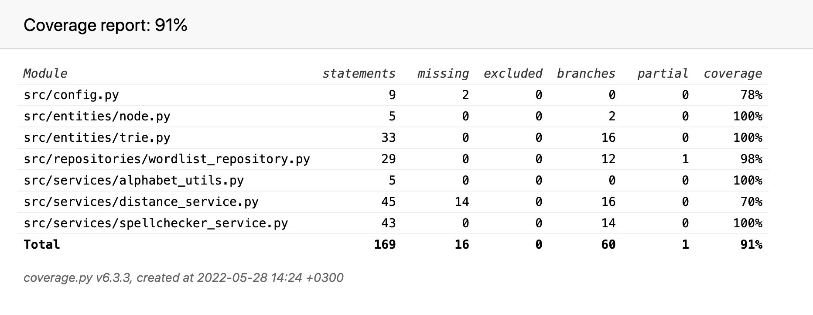

# Testing Document

### Automated unit tests

The program has been automatically tested using the _unittest_ framework.

- The app logic class SpellCheckerService.py is tested with the class [TestSpellcheckerService](../src/tests/spellchecker_service_test.py).

- The WordlistRepository class, handling the reading from and writing to the wordlist file on disk, is tested with the class [TestWordlistRepository](../src/tests/wordlist_repository_test.py). The tests utlize a separate wordlist, used for testing purposes only. The filename of the test wordlist is configured in the .env.test-file.

- The module providing the functions for calculating the Damerau-Levenshtein distance (distance_service) is tested with the class [TestDistanceService](../src/tests/distance_service_test.py).

- The classes for the implementation of the trie data structure (Trie and Node) are tested with the class [TestTrie](../src/tests/trie_test.py).

The current overall branch coverage of the automated tests is 91%:

