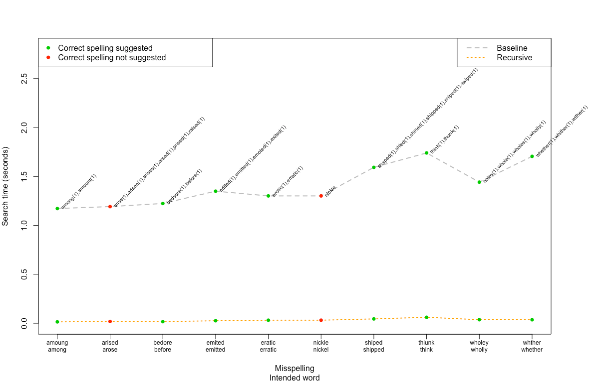
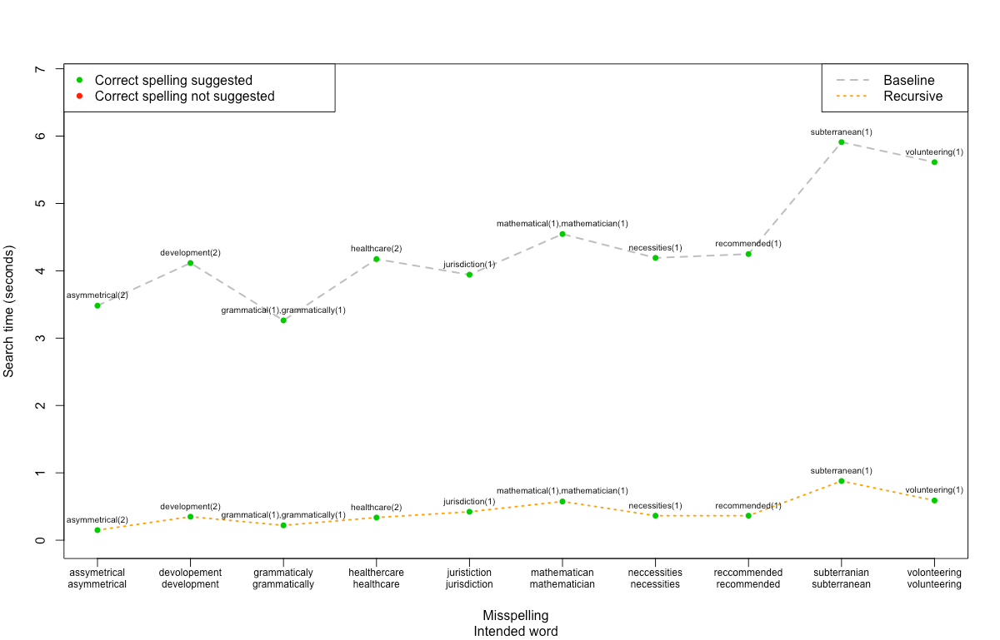
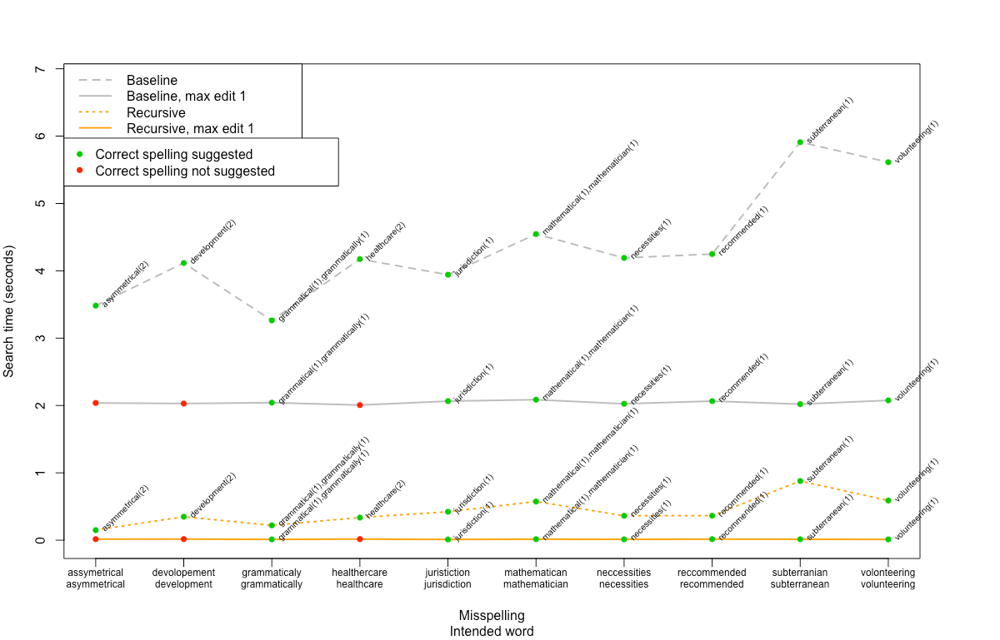
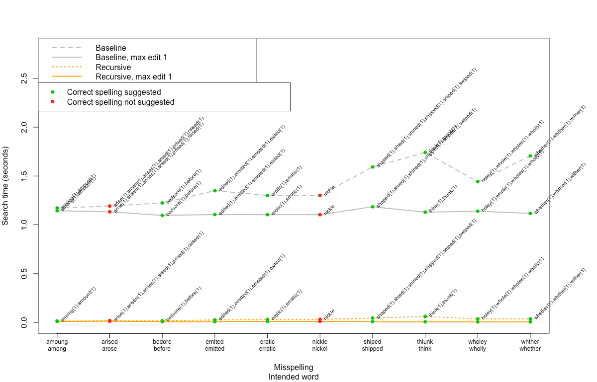

# Testing Document

## Unit tests

The program has been automatically tested using the _unittest_ framework.

- The app logic class SpellCheckerService.py is tested with the class [TestSpellcheckerService](../src/tests/spellchecker_service_test.py). This test class also includes tests for the module providing the recursive implementation of traversing the trie and calculating Damerau-Levenshtein distances on the fly (distance_service_recursive).  
The tests cover all functionalities available through the application user interface, e.g. asserting that correct results are returned for both the baseline and recursive spell checker, both when entering misspelled and correctly spelled words, with or without a maximum edit distance set beforehand or neighbouring keys prioritized when searching for close match word suggestions.

- The WordlistRepository class, handling the reading from and writing to the wordlist file on disk, is tested with the class [TestWordlistRepository](../src/tests/wordlist_repository_test.py). The tests utlize a separate wordlist, used for testing purposes only. The filename of the test wordlist is configured in the .env.test-file.  
The tests assert that reading from and writing to the wordlist file works as expected, and that words containing characters not in the allowed alphabet (as defined in [alphabet_utils.py](../src/services/alphabet_utils.py)) are skipped.

- The module providing the basic functions for calculating the Damerau-Levenshtein distance (distance_service) is tested with the class [TestDistanceService](../src/tests/distance_service_test.py).  
The tests include checks for different kinds of edit operations resulting in correct Damerau-Levensthein values as well as the matrix created during the calculation being filled in correctly.

- The classes for the implementation of the trie data structure (Trie and Node) are tested with the class [TestTrie](../src/tests/trie_test.py). The tests assert e.g. that adding keys to and searching for keys in the trie work as expected.

The current overall branch coverage of the unit tests is 97%:


## Performance testing

The performance of the two spellchecker implementations (baseline and recursive) with regard to speed is observable through the regular user interface of the application: the time used for the search for correctly spelled alternatives for a misspelled word, as well as the size of the dictionary of correctly spelled words, is printed out after each spelling check.

The dictionary used can be changed by changing the filename of the file containing the wordlist with correctly spelled words (WORDLIST_FILENAME) in the [.env-file](../.env). The wordlist file should be placed in the data directory and contain one word per row. Parameters and functions relating to the allowed alphabet can be changed in the [alphabet_utils.py](../src/services/alphabet_utils.py)-file.

More extensive perfomance tests can be run using the [PerformanceTester](../src/tests/performance_tester.py) class.  
The performance tester is started from the command line:

```bash
poetry run invoke performance-test
```

The tests can be run on a list of misspellings entered by the user, or by utilizing a randomly created list of misspelled words from the [Wikipedia list of common misspellings](https://en.wikipedia.org/wiki/Wikipedia:Lists_of_common_misspellings/For_machines) ([CC BY-SA 3.0](https://creativecommons.org/licenses/by-sa/3.0/)), which has been added to the repository.

The [spelling error parser](../src/tests/spelling_error_parser.py), which creates the list of random spelling errors, only adds misspelled words to the list if their corresponding correct spellings exist in the used dictionary. Misspellings where the misspelled word and/or the correct spelling contain characters not in the used alphabet (as defined in [alphabet_utils.py](../src/services/alphabet_utils.py)) are also skipped.

The desired length of the list of spelling errors can be set through the performance tester user interface, as well as the length of the misspelled words in the list. The user interface also allows for setting the maximum Damerau-Levenshtein edit distance allowed when running the tests, as well as prioritising substitutions by neighbouring keys,

The test results are written as .csv-files to the test_results-directory in the project root.

### Performance test results

The results for the performance tests reported below were obtained using a reference wordlist of correctly spelled English words downloaded from [http://app.aspell.net/create](http://app.aspell.net/create), created with the parameters:

diacritic: strip  
max_size: 60  
max_variant: 0  
special: hacker  
spelling: US GBs GBz

The words containing non-ASCII lowercase letters were removed. The resulting dictionary of English words contains **89 315 words**.

### Initial test results using the regular user interface

(Results obtained without prioritizing substitutions by neighbouring keys.)

**Misspelled word:** "zooom"  

| Algorithm | Result | Max edit distance | Time used (seconds) |
| --- | --- | --- | --- | 
| Baseline (for-loop) | zoom(1) | None | 1.0962682119570673 |
| Recursive | zoom(1) | None | 0.05443277070298791 |

| Algorithm | Result | Max edit distance | Time used (seconds) |
| --- | --- | --- | --- |
| Baseline (for-loop) | zoom(1) | 2 | 1.0738938050344586 |
| Recursive | zoom(1) | 2 | 0.047685077879577875 |

| Algorithm | Result | Max edit distance | Time used (seconds) |
| --- | --- | --- | --- | 
| Baseline (for-loop) | zoom(1) | 1 | 0.7003542319871485 |
| Recursive | zoom(1) | 1 | 0.009676200337707996 |
  
---
**Misspelled word:** "definateyl"  

| Algorithm | Result | Max edit distance | Time used (seconds) |
| --- | --- | --- | --- | 
| Baseline (for-loop) | definitely(2) | None | 4.408453032374382 |
| Recursive | definitely(2) | None | 0.2621015249751508 |

| Algorithm | Result | Max edit distance | Time used (seconds) |
| --- | --- | --- | --- | 
| Baseline (for-loop) | definitely(2) | 3 | 4.235222091898322|
| Recursive | definitely(2) | 3 | 0.12068807799369097 |

| Algorithm | Result | Max edit distance | Time used (seconds) |
| --- | --- | --- | --- | 
| Baseline (for-loop) | definitely(2) | 2 | 4.050534598995 |
| Recursive | definitely(2) | 2 | 0.0851048300974071 |
  
---
**Misspelled word:** "asdfgh"  

| Algorithm | Result | Max edit distance | Time used (seconds) |
| --- | --- | --- | --- | 
| Baseline (for-loop) | adage(3), ash(3), assign(3), aweigh(3), sigh(3), sough(3) | None | 2.2696444941684604 |
| Recursive | adage(3), ash(3), assign(3), aweigh(3), sigh(3), sough(3) | None | 0.16618962306529284 |

| Algorithm | Result | Max edit distance | Time used (seconds) |
| --- | --- | --- | --- | 
| Baseline (for-loop) | adage(3), ash(3), asiago(3), assign(3), aweigh(3), sigh(3), singh(3), sough(3) | 3 | 2.63363699009642 |
| Recursive | adage(3), ash(3), asiago(3), assign(3), aweigh(3), sigh(3), singh(3), sough(3) | 3 | 0.21872165193781257 |
  
---  
The recursive algorithm is clearly much faster than the baseline implementation of looping through every word in the wordlist and calculating the Damerau-Levenshtein distance to the each word separately.

Capping the allowed Damerau-Levensthein distance from the beginning seems to speed up both search implementations, especially if the automatic capping built-in in the algorithms starts to take effect slowly (i.e., the current lowest Damerau-Levenshtein distance found in the wordlist stays high for a long time.)    
The capping of the maximum edit distance allowed should on average have a bigger effect on the speed of the recursive algorithm, since entire trie branches of words with common prefixes can be skipped in one go if the limit is exceeded.

### Test results using the Performance Tester

Two random list of 10 misspellings were generated from the [Wikipedia list of common misspellings](https://en.wikipedia.org/wiki/Wikipedia:Lists_of_common_misspellings/For_machines): one with misspelled words with a length of 6 characters (shorter misspellings), and the other with misspellings that have a length of 12 characters (longer misspellings). These lists of spelling errors are by no means representative for spelling errors in general, but the results give some pointers on the performance of the spell checker algorithms and the effect of the optional parameters.

All words from both lists were spell checked using the [performance tester script](../src/tests/performance_tester.py). In the two first runs no maximum edit distance was set beforehand and substitutions by neighbouring keys were not prioritized:

**Shorter misspellings:**


**Longer misspellings:**


As expected, spell checking longer words takes more time, as the dimensions of the Damerau-Levensthein calculation matrix grow.
Equally as expected, the recursive approach is much faster than the baseline implementation, since less calculations are required, as described in the [implementation document](../documentation/implementation_document.md). 

The graph showing the results of spell checking the shorter misspellings also exposes some of the weaknesses in the Spellchecker app:

- **Lack of heuristic for prioritising the suggestions**. Some of the misspellings return a long list of suggested correct spellings, each with the same Damerau-Levenshtein distance to the misspelled words. Picking the most relevant suggestion would require for example knowledge of context or data on how frequently different words occur in English texts in general. (Based on intuitive notion of frequency, 'bedore' seems for example to be a more likely misspelling of the word 'before' than 'bedsore', but the algorithm has no way of picking one over the other.)
Tests below show the results of introducing one specific and quite limited heuristic, namely prioritising substitutions by neighbouring keys. 

- **Poor accuracy when spelling error is not [typographical](https://en.wikipedia.org/wiki/Typographical_error)**. Some spelling errors are not caused by mechanical slips on a keyboard, but occur because the writer simply does not know how to spell the word, uses a similarly pronounced homonym by mistake, or makes a grammatical error, as for example in the case 'arised - arose'. In these cases the correct spelling might have a long Damerau-Levenshtein distance to the misspelling and is not suggested, since words with lower edit distance are found.

- **Accuracy of reference dictionary**. For the spell checking to be accurate, the reference dictionary has to be accurate too. (This naturally applies to all spell checkers). The wordlist used in the tests contains the somewhat obscure 'nickle', which means the misspelling of 'nickel' is not recognized.

#### Setting maximum edit distance

Both the recursive and the baseline implementation benefit with regard to speed from setting the maximum Damerau-Levenshtein allowed beforehand, especially when the misspelled words are long. At the same time, capping the allowed edit distance too low may also lead to the algorithm discarding the actual intended spelling for being too far away, as can be seen in the results for the longer misspellings:

**Longer misspellings:**


**Shorter misspellings:**



#### Prioritising neighbouring keys

The optional possibility to prioritise substitutions by neighbouring keys on the keyboard by assigning these substitutions a lower edit cost than other edit operations, was tested on a longer list of misspellings. A list of 300 misspelled words was randomly generated from the Wikipedia list of common spelling errors. All words were then run through the recursive implementation of the spell checker, first without prioritising neighbouring keys and then with the neighbouring key prioritisation activated. The results were then checked for accuracy, that is, if the intended spelling was among the spellings suggested.

The results were discouraging: while the mean number of suggested spellings decreased when prioritising neighbouring keys, so did also the success rate, in quite a significant way:

| Heuristic | Mean suggestion count | Successes (correct word suggested) | Fails | 
| --- | --- | --- | --- |
| None | 1.856667 | 294 | 6 |
| Neighbouring key | 1.456667 | 253 | 47 |

Substitutions by neighbouring keys seems not to be a prominent enough cause of spelling errors in the Wikipedia material to be a particularly useful heuristic. 

For the sake of comparison the same test was run on a list of 300 spelling errors randomly picked from a list of spelling errors collected from typewritten or terminal input by staff and students in the Department of Information Studies of Sheffield University in the 1980's, consisting mainly of keyboarding errors, and assumedly typed by persons with a good knowledge of English. (This list is part of the Birkbeck spelling error corpus, made available by the [Oxford Text Archive](https://ota.bodleian.ox.ac.uk/repository/xmlui/handle/20.500.12024/0643?show=full).). 

The results for the Sheffield data were somewhat better with regard to accuracy, but prioritising neighbouring keys still led to a decline in the success rate, compared to the algorithm were all edit operations were assigned an equal weight:

| Heuristic | Mean suggestion count | Successes (correct word suggested) | Fails  | 
| --- | --- | --- | --- |
| None | 1.633333 | 292 | 8 |
| Neighbouring key | 1.483333 | 270 | 30 |

A closer look at the results revealed that the runs with activated neighbouring key priorisation did indeed return accurate (and fewer) suggestions for misspellings were such a substitution had taken place (nost->most, wouls->would), but at the same time, these successes were outnumbered by the cases where the neighbouring key priorisation led to failure to suggest the intended spelling for words where the typographical mistake was in fact an insertion, deletion and/or transposition. 

To sum up: while prioritising substitutions by neighbouring keys is easy to implement in the algorithm for calculating Damerau-Levenshtein distance, the usefulness of such a priorisation alone seems quite limited.  


**Reference:**
University of Oxford, Birkbeck spelling error corpus / Roger Mitton, Oxford Text Archive, http://hdl.handle.net/20.500.12024/0643.
