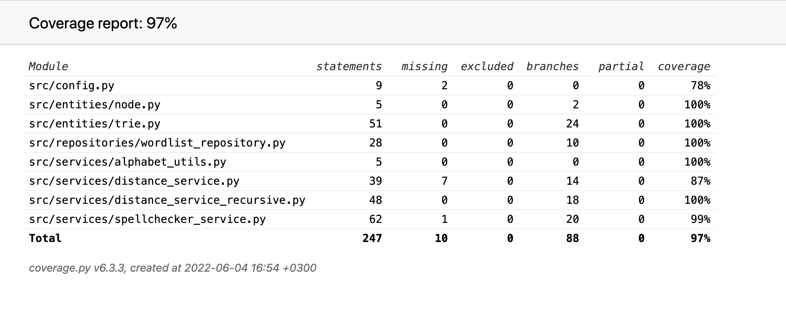

# Testing Document

## Automated unit tests

The program has been automatically tested using the _unittest_ framework.

- The app logic class SpellCheckerService.py is tested with the class [TestSpellcheckerService](../src/tests/spellchecker_service_test.py). This test class also includes tests for the module providing the recursive implementation of traversing the trie and calculating Damerau-Levenshtein distances on the fly (distance_service_recursive).

- The WordlistRepository class, handling the reading from and writing to the wordlist file on disk, is tested with the class [TestWordlistRepository](../src/tests/wordlist_repository_test.py). The tests utlize a separate wordlist, used for testing purposes only. The filename of the test wordlist is configured in the .env.test-file.

- The module providing the basic functions for calculating the Damerau-Levenshtein distance (distance_service) is tested with the class [TestDistanceService](../src/tests/distance_service_test.py).

- The classes for the implementation of the trie data structure (Trie and Node) are tested with the class [TestTrie](../src/tests/trie_test.py).

The current overall branch coverage of the automated tests is 97%:

## Performance testing

Testing of the performance of the two spellchecker implementations on different size dictionaries has been carried out manually. 

The program prints out the time used for the search for correctly spelled alternatives for a misspelled word after each spelling check, as well as the size of the dictionary. The timing is handled by the [SpellcheckerService-class](../src/services/spellchecker_service.py#L94).

The dictionary used can be changed by changing the filename of the file containing the wordlist with correctly spelled (WORDLIST_FILENAME) in the [.env-file](../.env). The wordlist file should be placed in the data directory and contain one word per row.  
**Only letters a-z** are allowed for now.

### Some initial results

Wordlist used for tests downloaded from [http://app.aspell.net/create](http://app.aspell.net/create).

**Word searched for:** "zbra"  
**Dictionary size:** 90 555 words.  

| Algorithm | Result | Max edit distance | Time used (seconds) |
| --- | --- | --- | --- | 
| Baseline (for-loop) | bra(1), zara(1), zebra(1)| None | 2.920761691988446 |
| Recursive | bra(1), zara(1), zebra(1) | None | 0.9957589950645342 |

| Algorithm | Result | Max edit distance | Time used (seconds) |
| --- | --- | --- | --- | 
| Baseline (for-loop) | bra(1), zara(1), zebra(1)| 3 | 1.1006217879476026 |
| Recursive | bra(1), zara(1), zebra(1) | 3 | 0.144506115000695 |

| Algorithm | Result | Max edit distance | Time used (seconds) |
| --- | --- | --- | --- | 
| Baseline (for-loop) | bra(1), zara(1), zebra(1)| 1 | 0.5125236120074987 |
| Recursive | bra(1), zara(1), zebra(1) | 1 | 0.008967792033217847 |

The recursive algorithm is much faster than the naive implementation of looping through every word in the wordlist and calculating the Damerau-Levenshtein distance to the each word separately.  

Introducing a maximum edit distance speeds up both algorithms, but has an even bigger effect on the recursive implementation.  
